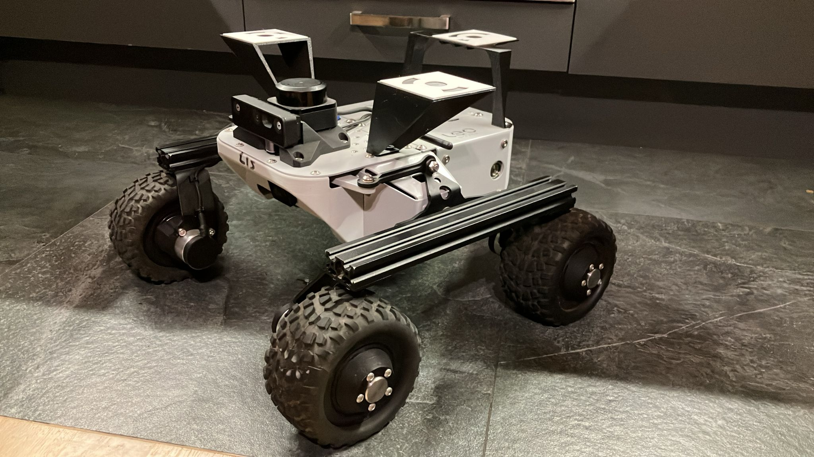

# ros2_lidar_georeference

ros2 package for lidar and gnss sensors data fusion

package is designed for leo rover, but can be ported to other machines that run rosbridge and nginx. just update 'dest' nginx directory in script/setup.sh