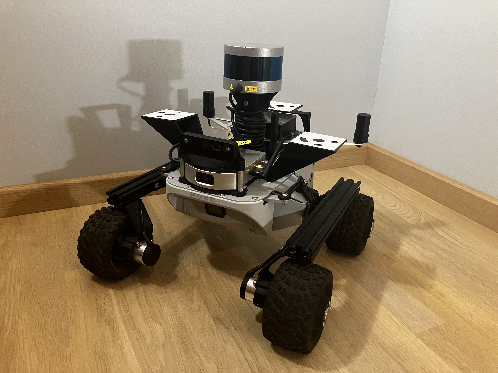
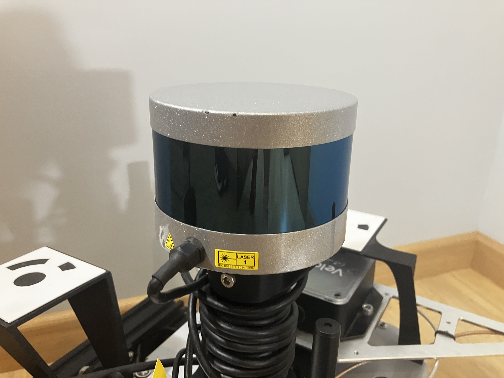
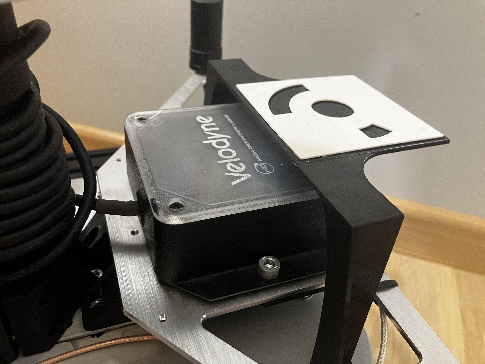
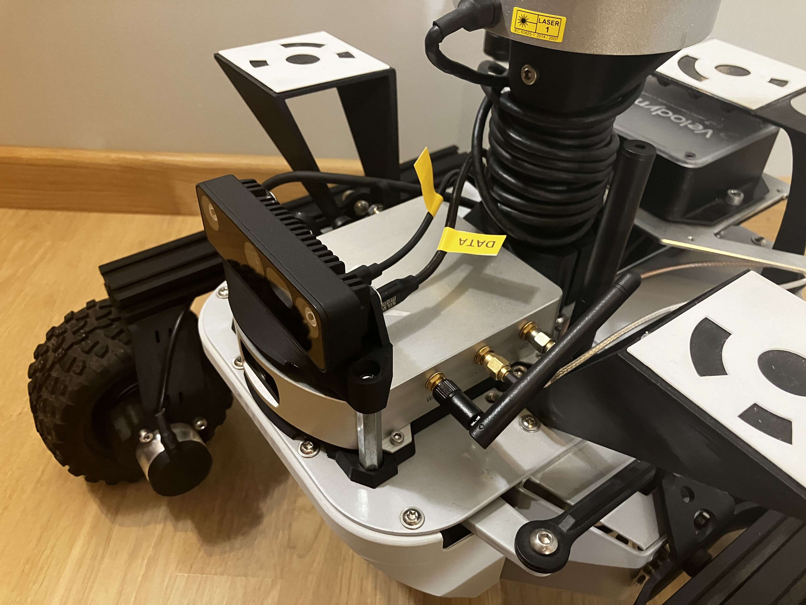
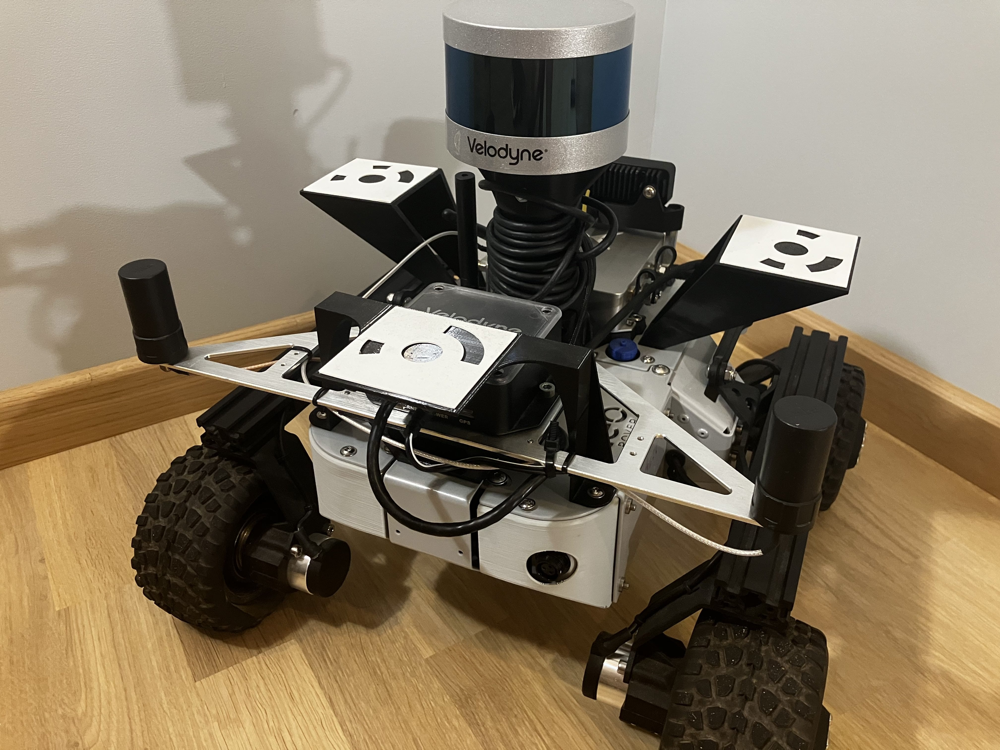

# ros2_lidar_georeference

## Introduction

This package is developed for the [Leo Rover](https://www.leorover.tech/) platform, but can be adapted to other systems running ROS 2 Jazzy, Rosbridge, and Nginx.

On user request, the package records [Velodyne](https://github.com/ros-drivers/velodyne) LiDAR point clouds together with ECEF positioning data published by the [Fixposition](https://github.com/fixposition/fixposition_driver) driver, storing the data in a temporary workspace. When the measurement session is stopped, the collected data is fused offline into a single .las file ([LAS version 1.2](https://liblas.org/_static/files/specifications/asprs_las_format_v12.pdf)), which is then made available for user download.

| Leo Rover platform with sensors installed |
|----------|
|  |

## Preparation: Velodyne VLP16

| VLP16 Sensor | Interface Box |
|----------|----------|
|  |  |

After connecting the Interface Box to Leo Rover onboard Raspberry Pi 4, run nmap to check if Interface Box was automatically assigned a local IP address. In nmap response you should find a following block.

```bash
$ nmap 10.0.0.1/24
...
Nmap scan report for 10.0.0.80
Host is up (0.013s latency).
Not shown: 998 filtered tcp ports (no-response)
PORT   STATE SERVICE
23/tcp open  telnet
80/tcp open  http
MAC Address: xx:xx:xx:xx:xx:xx (Velodyne)
```

If this block is missing run:

```bash
sudo ip addr add 192.168.1.100/24 dev br0
sudo ip link set br0 up
```

If the bridge is configure properly between br0 and eth0 interfaces, the Interface Box should be assigned an IP address. Run nmap again to verify.

After configuring the sensor network connection, open sensor ip address in the browser. You should see the following Web UI.

...

To verify that the sensor works as it should, install VeloView and run nmap again to see your local PC IP address in Leo Rover local network. Pass this IP address to the Velodyne Web UI and click "Set" to confirm.

Open VeloView and add a new Sensor Stream for VLP16. You should see a live point cloud data.

After verifying, change the stream IP address in Velodyne Web UI back to 10.0.0.1.

## Preparation: Fixposition Vision-RTK 2 

| Vision-RTK 2 Sensor | GNSS Antennas |
|----------|----------|
|  |  |

## Project: Build and Upload

Repository contains a Dockerfile definition of a an image that builds all the packages in release mode, without symlinks. This way we can assure that the install/ folder is portable and can be copied between machines. If you have docker installed and daemon running, run:

```bash
make build
```

As a result, you will see a zip archive `upload.zip`. It contains the contents of the `install` folder as well as the `makefile`. To upload the project on the Leo Rover, connect to its WiFi network and run:

```bash
make upload
```

> [!CAUTION]  
> If you're building this project on a Raspberry PI 4, check the `clean` rule definition in `makefile` before executing it. You will need to change the if-else statement to perform the correct cleanup action.

At this point the project is built and ready for execution on the Leo Rover. As the last step you can run:

```bash
make clean
```

To clean the environment on your local PC.

> [!WARNING]  
> Executing `make clean` does not clean the docker builder cache. To do so run `docker builder prune`.

## Project: Configure and Run

Connect to Leo Rover WiFi network and SSH to remote terminal. First, unzip the uploaded project:

```bash
unzip upload.zip
```

And run the setup script so that ROS2 can see new packages:

```bash
source install/setup.bash
```

Next step is to update the configuration of Velodyne and Fixposition drivers to match the IP addresses of sensors in the Leo Rover 10.0.0.1/24 network. To do so, run:

```bash
make configure
```

> [!WARNING]  
> For non standard installation, update `VELODYNE_IP` and `FIXPOSITION_IP` variables in the makefile.

After you have swapped IP addresses in the configuration files, inject a new web config to the running nginx instance:

```bash
make nginx
```

> [!WARNING]  
> The default port for the new web service is 8888. If the port is already in use in your environment, update the `SITE_PORT` variable in the makefile.

Go to 10.0.0.1:8888 to verify if Web UI is available.

Once the injection is completed, you need to load group changes and source the setup script one more time:

```bash
newgrp webshare
source install/setup.bash
```

Now the environment is fully prepared to launch project nodes (in `screen` so they will persist even after closing the SSH terminal session):

```bash
make run
```

After a few moments (required for rosbridge instance to spin up), you will see the status in Web UI change to "Connected".

## Project: Shutdown and Cleanup

To shutdown the project, find the screen id and then use it to reattach:

```bash
screen -list
screen -r <screen id>
```

Press CTRL + C to close all nodes.

To clean all the environment configuration and files, run:

```bash
make clean
```